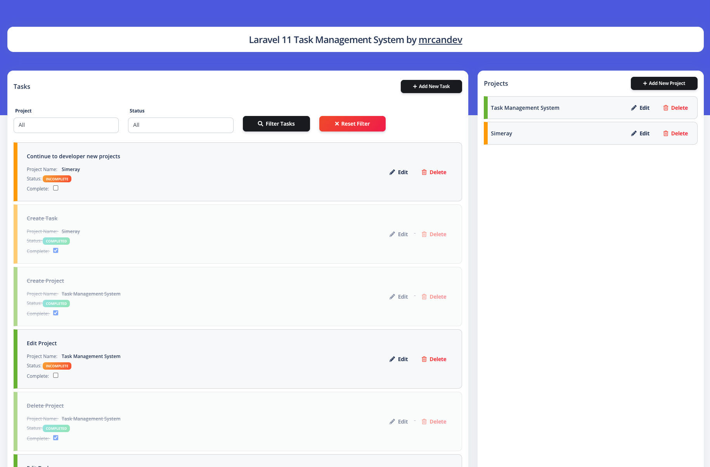
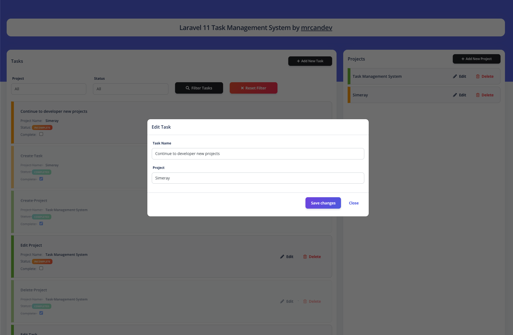

<<<<<<< HEAD
# Laravel Task Management System

In this repo I developed a Task Management System with Laravel 11. You can control or contribute to the use of Model, Ajax, Controller.
## Demo Video
[](https://www.youtube.com/watch?v=_pf5jAt-eiw)

## Screenshots

Laravel 11 Task Management System Screenshot


Laravel 11 Task Management System Screenshot 2



## Features
- Create Project
- Edit Project
- Delete Project
- Create Task
- Edit Task
- Delete Task
- Sorting with Drag and Drop System
- Status Update
- Filter by Status


## Table of Contents
- [Prerequisites](#prerequisites)
- [Installation](#installation)
- [Usage](#usage)
- [Contributing](#contributing)
- [Supporting](#supporting)
- [License](#license)

## Prerequisites
Before you begin, ensure you have met the following requirements:
- PHP >= 8.2 
- MySQL
- Composer installed globally

## Installation
To install and set up the project locally, follow these steps:

1. Clone the repository:
   ```bash
   git clone https://github.com/mrcandev/Laravel-Task-Management-Example.git

2. Navigate to the project directory:
    ```bash
    cd project_folder

3. Install PHP dependencies:
    ```bash
    composer install

4. Set up your environment variables:
    ```bash
    cp .env.example .env
    php artisan key:generate

5. Run migrations (optional):
    ```bash
    php artisan migrate


## Usage
To install and set up the project locally, follow these steps:
1. To run the application, use the following command:
    ```bash
    php artisan serve

Visit http://localhost:8000 in your web browser to view the application.


## Contributing
Contributions are welcome! Here's how you can contribute to this project:

1. Fork the repository.
2. Create a new branch (git checkout -b feature/your-feature-name).
3. Commit your changes (git commit -am 'Add some feature').
4. Push to the branch (git push origin feature/your-feature-name).
5. Create a new Pull Request.

## Copyrights
I would like to point out that I used the free Argon open source template for design. You can click on the link for other details and premium version.

Link: https://www.creative-tim.com/product/argon-dashboard


## Supporting
If you find this project useful and would like to support its development, you can:
- **Star the repository**: If you find this project helpful or interesting, please give it a star.
- **Fork and contribute**: Contributions are welcome! Feel free to fork this project and submit pull requests.
- **Donate**: If you'd like to make a monetary donation to support the developer, you can use the sponsor button on GitHub or visit the developer's profile for more options.

## License
This project is licensed under the [MIT license](https://opensource.org/licenses/MIT).
.
=======
# laravel-aws-cicd


## Getting started

To make it easy for you to get started with GitLab, here's a list of recommended next steps.

Already a pro? Just edit this README.md and make it your own. Want to make it easy? [Use the template at the bottom](#editing-this-readme)!

## Add your files

* [Create](https://docs.gitlab.com/user/project/repository/web_editor/#create-a-file) or [upload](https://docs.gitlab.com/user/project/repository/web_editor/#upload-a-file) files
* [Add files using the command line](https://docs.gitlab.com/topics/git/add_files/#add-files-to-a-git-repository) or push an existing Git repository with the following command:

```
cd existing_repo
git remote add origin https://gitlab.com/Harsh2004/laravel-aws-cicd.git
git branch -M main
git push -uf origin main
```

## Integrate with your tools

* [Set up project integrations](https://gitlab.com/Harsh2004/laravel-aws-cicd/-/settings/integrations)

## Collaborate with your team

* [Invite team members and collaborators](https://docs.gitlab.com/user/project/members/)
* [Create a new merge request](https://docs.gitlab.com/user/project/merge_requests/creating_merge_requests/)
* [Automatically close issues from merge requests](https://docs.gitlab.com/user/project/issues/managing_issues/#closing-issues-automatically)
* [Enable merge request approvals](https://docs.gitlab.com/user/project/merge_requests/approvals/)
* [Set auto-merge](https://docs.gitlab.com/user/project/merge_requests/auto_merge/)

## Test and Deploy

Use the built-in continuous integration in GitLab.

* [Get started with GitLab CI/CD](https://docs.gitlab.com/ci/quick_start/)
* [Analyze your code for known vulnerabilities with Static Application Security Testing (SAST)](https://docs.gitlab.com/user/application_security/sast/)
* [Deploy to Kubernetes, Amazon EC2, or Amazon ECS using Auto Deploy](https://docs.gitlab.com/topics/autodevops/requirements/)
* [Use pull-based deployments for improved Kubernetes management](https://docs.gitlab.com/user/clusters/agent/)
* [Set up protected environments](https://docs.gitlab.com/ci/environments/protected_environments/)

***

# Editing this README

When you're ready to make this README your own, just edit this file and use the handy template below (or feel free to structure it however you want - this is just a starting point!). Thanks to [makeareadme.com](https://www.makeareadme.com/) for this template.

## Suggestions for a good README

Every project is different, so consider which of these sections apply to yours. The sections used in the template are suggestions for most open source projects. Also keep in mind that while a README can be too long and detailed, too long is better than too short. If you think your README is too long, consider utilizing another form of documentation rather than cutting out information.

## Name
Choose a self-explaining name for your project.

## Description
Let people know what your project can do specifically. Provide context and add a link to any reference visitors might be unfamiliar with. A list of Features or a Background subsection can also be added here. If there are alternatives to your project, this is a good place to list differentiating factors.

## Badges
On some READMEs, you may see small images that convey metadata, such as whether or not all the tests are passing for the project. You can use Shields to add some to your README. Many services also have instructions for adding a badge.

## Visuals
Depending on what you are making, it can be a good idea to include screenshots or even a video (you'll frequently see GIFs rather than actual videos). Tools like ttygif can help, but check out Asciinema for a more sophisticated method.

## Installation
Within a particular ecosystem, there may be a common way of installing things, such as using Yarn, NuGet, or Homebrew. However, consider the possibility that whoever is reading your README is a novice and would like more guidance. Listing specific steps helps remove ambiguity and gets people to using your project as quickly as possible. If it only runs in a specific context like a particular programming language version or operating system or has dependencies that have to be installed manually, also add a Requirements subsection.

## Usage
Use examples liberally, and show the expected output if you can. It's helpful to have inline the smallest example of usage that you can demonstrate, while providing links to more sophisticated examples if they are too long to reasonably include in the README.

## Support
Tell people where they can go to for help. It can be any combination of an issue tracker, a chat room, an email address, etc.

## Roadmap
If you have ideas for releases in the future, it is a good idea to list them in the README.

## Contributing
State if you are open to contributions and what your requirements are for accepting them.

For people who want to make changes to your project, it's helpful to have some documentation on how to get started. Perhaps there is a script that they should run or some environment variables that they need to set. Make these steps explicit. These instructions could also be useful to your future self.

You can also document commands to lint the code or run tests. These steps help to ensure high code quality and reduce the likelihood that the changes inadvertently break something. Having instructions for running tests is especially helpful if it requires external setup, such as starting a Selenium server for testing in a browser.

## Authors and acknowledgment
Show your appreciation to those who have contributed to the project.

## License
For open source projects, say how it is licensed.

## Project status
If you have run out of energy or time for your project, put a note at the top of the README saying that development has slowed down or stopped completely. Someone may choose to fork your project or volunteer to step in as a maintainer or owner, allowing your project to keep going. You can also make an explicit request for maintainers.
>>>>>>> 16bdf20acaf2ce4e8f2642e5a652baddbeedb853
